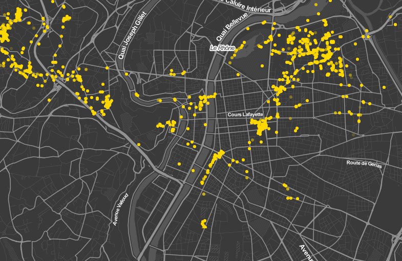

# LyonFlow

>Date : Jan.2019 - Mar.2019 

>Auteurs : Guillaume CHATERRAUX, Hoang Khoi LE, Gonzalo CANET CERDAN

# Description du projet

Dans le cadre du MOS 5.5 "Visualisation interactive de données" de l'Ecole Centrale de Lyon, par groupe de 3, nous devions présenter une visualisation innovante de données collectées dans le cadre de notre propre activité. Nous avons choisi de nous intéresser à la question des déplacements d’un échantillon de Centraliens. Plus précisément, quels sont les trajets effectués par des élèves sur Lyon et sa banlieue ?

Le projet consiste en une page d'accueil où vous choisissez la visualisation que vous voulez afficher. Il se compose des 5 visualisations suivantes : 
* Bar chart
* Bar chart stacked
* Pie chart
* Map
* Nodes

Le projet est disponible [ici](https://gcharrea.github.io/LyonFlow/index) :
=======
## Description du projet

Dans le cadre du MOS 5.5 "Visualisation interactive de données" de l'Ecole Centrale de Lyon, par groupe de 3, nous devions présenter une visualisation innovante de données collectées dans le cadre de notre propre activité. Nous avons choisi de nous intéresser à la question des déplacements d’un échantillon de Centraliens. Plus précisément, quels sont les trajets effectués par des élèves sur Lyon et sa banlieue ?

Le projet est disponible [ici](https://gcharrea.github.io/LyonFlow/index) :

Le projet consiste en une page d'accueil où vous choisissez la visualisation que vous voulez afficher. Il se compose des 5 visualisations suivantes : 
* **Bar chart** - Distance parcourue chaque mois pour chaque mode de transport
* **Bar chart stacked** - Mêmes distances groupées ou stacked
* **Pie chart** - Proportion de la distance parcourue chaque jour de la semaine par chaque mode de transport
* **Map** - Carte de Lyon avec l'emplacement d'une personne
* **Heat map** - Carte avec les zones les plus fréquentées en couleur

C'est l'aspect que l'index présentera en entrant dans la page et qui reste dans l'en-tête de chaque visualisation pour passer de l'une à l'autre.

Voici un exemple d'un des affichages correspondant à la représentation des emplacements à Lyon

