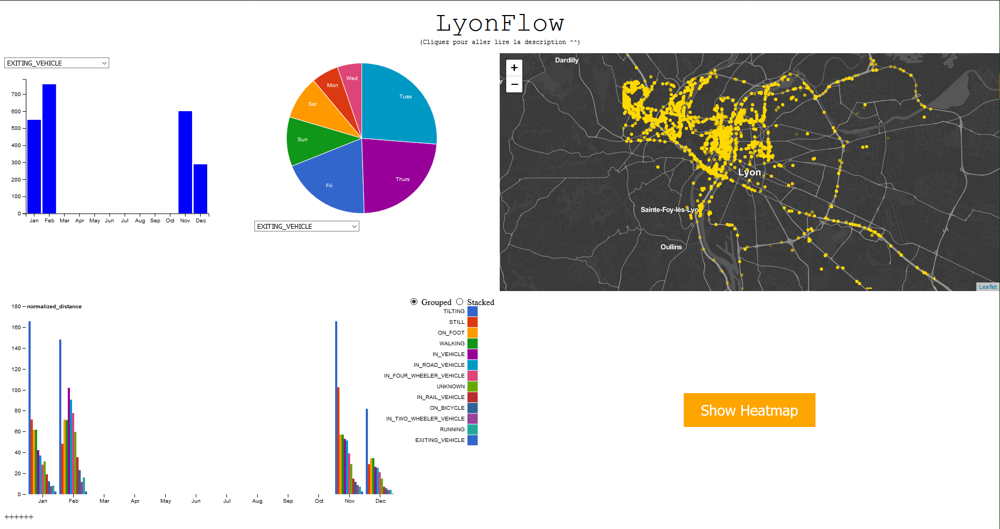

# LyonFlow

>Date : Jan.2019 - Mar.2019 

>Auteurs : Guillaume CHARREAUX, Hoang Khoi LÊ, Gonzalo CANET CERDAN

# Description du projet

Dans le cadre du MOS 5.5 "Visualisation interactive de données" de l'Ecole Centrale de Lyon, par groupe de 3, nous devions présenter une visualisation innovante de données collectées dans le cadre de notre propre activité. Nous avons choisi de nous intéresser à la question des déplacements d’un échantillon de Centraliens. Plus précisément, quels sont les trajets effectués par des élèves sur Lyon et sa banlieue ?

Le projet est disponible [ici](https://gcharrea.github.io/LyonFlow/index) :

Le projet consiste en une page composée des 5 visualisations suivantes : 
* **Bar chart** - Distance parcourue chaque mois pour chaque mode de transport
* **Bar chart stacked** - Mêmes distances groupées ou stacked
* **Pie chart** - Proportion de la distance parcourue chaque jour de la semaine par chaque mode de transport
* **Map** - Carte de Lyon avec l'emplacement d'une personne
* **Heat map** - Carte avec les zones les plus fréquentées en couleur (Attention, cette visualisation met du temps à charger)

Les graphiques sur la gauche de l'écran étudient les distances parcourues et permettent de relever des différences dans les habitudes de déplacement selon les jours de la semaine ou les périodes de l'année.
Les cartes permettent notamment de mettre en évidence certains points de congestion durant les déplacements, mais aussi les lieux habituellement fréquentés. Il pourrait être intéressant d'analyser de telles cartes en comparaison avec des cartes de la pollution, de l'habitat etc ...

Ci-dessous une prise de vue de l'affichage du projet présent à l'adresse fournie ci-dessus :

# Données utilisées

Nous avons utilisé pour ce projet des données issues de Google Maps. Afin d'utiliser votre propre jeu de données, nous vous invitons à remplacer le fichier location_history.json se situant dans visu/data par le vôtre et à lancer le script Python format_data.py se trouvant dans le même dossier.
Comme vous pourrez le constater en parcourant les données, celles-ci ne sont pas que géographiques, des metadatas telles que l'activité exercée au moment où la position a été relevée sont présentes, nous avons essayé de les représenter, si certaines semblent évidentes comme WALKING, d'autres le sont moins et nous ne pouvons que vous inviter à effectuer des recherches sur ce sujet.

# Crédits

Afin de réaliser certaines des visualisations présentes, nous nous sommes basés sur les projets suivants :
* http://bl.ocks.org/Sumbera/10463358?fbclid=IwAR10PZJ73rUd1MvQw9rGaHsFK1MXprtbuvYTIQW7RI2MYV0Yo5MQVNoQlvM
* http://bl.ocks.org/awoodruff/0883d211538ed05a82fd1b82bd65bf34?fbclid=IwAR243EfRY-Ox4xvKqekrsdof8OX0_fX_iizZJ5IUqe6cptZciipVpMhjPCc
